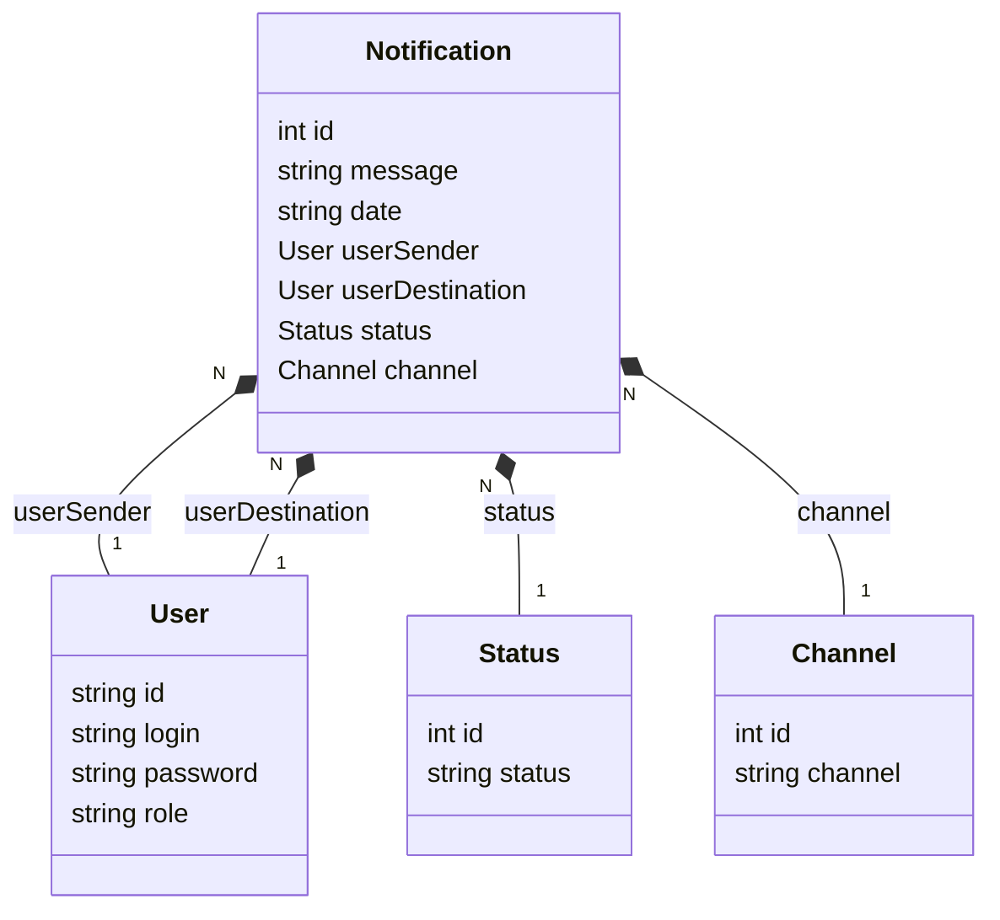

# REST API with Spring Boot 

This **API** is a basic  **Task Scheduler** focused on sending a message at the selected date and time, with exception handling, validations and authentications.




## 💻 Tecnologies

- Java 21
- Maven
- Spring Boot 3 
- JPA + Hibernate
- JWT
- Spring Security
- Spring Scheduler
- Lombok
- PostgreSQL

## Some functionalities available in the API

- ✅ Java model class with validation
- ✅ JPA repository
- ✅ JPA Pagination
- ✅ PostegreSQL database (you can use any database of your preference)
- ✅ Controller, Service, Repository e Config layers
- ✅ Has-Many relationships
- ✅ Java Records as DTO (Data Transfer Object)
- ✅ Hibernate / Jakarta Validation

### Not implemented (maybe in a future version)

- Caching
- Data Compression
- Throttling e Rate-limiting
- Profiling the app
- Test Containers
- Docker Build

## Usage

1. start the application with Maven
2. The API will be accessible at http://localhost:8080


## API Endpoints
The API provides the following endpoints:

```markdown
GET /notification - Get the Notification by ID. (All users are allowed).

POST /notification - Register a new Notification (All users are allowed).

DELETE /notification - Delete a registered Notification (ADMIN access required).

POST /auth/login - Login to the Application.

POST /auth/register - Register a new User in the Application (ADMIN access required).
```

## Authentication
The API uses Spring Security to control authentication. The following functions are available:

```
USER -> Standard user function for logged-in users.
ADMIN -> Administrator function for managing partners (registering new partners).
```
To access protected endpoints only as an ADMIN user, provide the appropriate authentication credentials in the request header.

## Database
The project uses [PostgresSQL](https://www.postgresql.org/) as its database.


